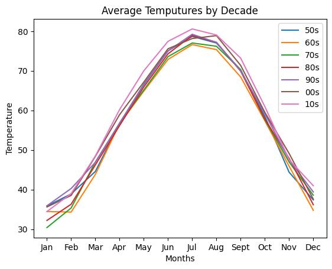

<h1>Global Warming in Louisville KY <h2>

<h1> <b>Project scope </b></h1>

I started with the question, can you see a global warming trend from the 1950's to now?
I downloaded the daily average, high, and low temps from https://www.noaa.gov/ for louisville KY. 
 
I have 2 versions of the project. The first was how it was submitted for Code Louisville. The second one was revised to show my progress a year later. I was able to add macine learning to the project as well and predict the weather for the rest of the decade. 

<li> I averaged the decades by month so the data wouldn't be overwhelming.</li>
<li> I then plotted the data to see if a trend was visiable.  </li> 
 

| Challenges    | Project One | Project Two |
| ----------- | ----------- | ------------ |
| DateTime      | The first project DateTime was too much for me to tackle. I couldn't figure how to work out the issues using old date ranges to current. I ended up splitting the spreadsheet manually to do the project.| I solved the problem by splitting the date string to separate columns and preforming some math to the solve the problem. Then I merged them back. |
| Machine Learning | This was just a want at the time. I didn't have the skill to even try at this point. | I used Neuralprophet to to do a date time series model to predict the weather for the remainder of the decade. The trend looks correct. The predictions have been off a bit throughout the current year. I suspect its all the additional factors the factor into weather and this was expected on my end. |

<h1><b>Data project requirements for Project one:</b></h1>

1. read data in 
2. Manipulate or clean your data. 
3. Analyze your data 
4. Visualize your data 
5. Interpreting my data
6. Commit to GitHub 5 times 
7. submit project 

<h3><b><i>If you want to run the project I would advise creating a virtual environment and installing the packages. Some of the dependencies are older versions and require that version to run correctly. </I></b></h3>

<!-- 
source venv/bin/activate
deactivate 
-->